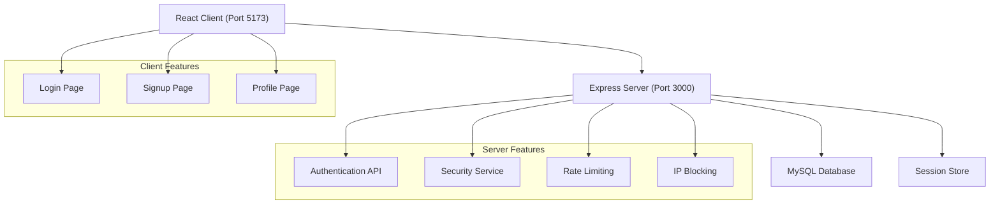

# Login Edge

A brute force protected full-stack authentication application built with React and Node.js, featuring advanced security measures including rate limiting, IP blocking, and user account suspension.

## Setup Instructions

### Prerequisites

- Node.js (v18 or higher)
- MySQL-8 database instance
- npm(v9 or higher) package manager

### Installation & Setup

1. **Clone the repository**
   ```bash
   git clone https://github.com/VenkatKaranam/login-edge.git
   cd login-edge
   ```
2. **Environment Configuration**

   Copy the `env.example` file and rename it to `.env` in the root directory.
   
   Then update the following environment variables as per your configuration:
   ```
   DB_HOST=localhost
   DB_USER=your_db_user
   DB_PASSWORD=your_db_password
   DB_NAME=your_db_name
   SESSION_SECRET=your_session_secret
   ```

2. **Install dependencies**

   This command installs all the necessary dependencies for **both the client and server** in the respective folders.
   ```bash
   npm install:all
   ```

4. **Setup MySQL database**
    - Create a MySQL database with the name specified in your `.env` file
    - The application will automatically sync database models on startup
    - If you encounter issues with database schema auto-sync, drop the existing tables and manually import the schema from `database-schema.sql`.
### Development

1. **Start Frontend and Backend servers**
   ```bash
   npm run dev
   ```
   - The client will start on port 5173 with API proxy configured to backend server port
   - The server will start on port 3000 (or the port specified in your `.env` file)

 check http://localhost:5173/

### Production Build

1. **Build the client and server**
   ```bash
   npm run build
   ```
   - This builds the client to `../server/public` directory
   - And build server js files to `../server/dist` directory

2. **Build and start the server**
   ```bash
   npm start
   ```

### Testing

Run the test suite:
   ```bash
      npm test
   ```

To understand all the available commands for both the server and client, refer to the root `package.json` file in the repository:

👉 [Check package.json](https://github.com/VenkatKaranam/login-edge/blob/master/package.json)

## Architecture

### Overview
Login Edge follows a client-server architecture with a React frontend and Express.js backend.



### Tech Stack

**Frontend:**
- React 19 with TypeScript
- Vite for build tooling and development server
- React Router DOM for routing
- Axios for HTTP requests
- Less for styling

**Backend:**
- Node.js with Express framework
- TypeScript for type safety
- Sequelize ORM with MySQL database
- bcrypt for password hashing
- express-session for session management

**Testing:**
- Jest for backend unit testing

### Security Features

The application implements multiple layers of security:

- **IP Blocking**: An IP address is temporarily blocked for 15 minutes if it records more than 20 failed login attempts within a 5-minute period.
- **User Suspension**: A user account is suspended for 15 minutes after exceeding 5 consecutive failed login attempts within a 5-minute window.
- **Session Management**: Secure user sessions are maintained with configurable expiration settings to enhance security.

### Database Models

The application uses three main models:

- `User`: Stores user account information
- `UserLoginAttempt`: Tracks login attempts to enforce IP blocking and user account suspension policies.
- `Ip`: Manages IP-based blocking and tracking

### API Architecture

The server exposes RESTful APIs:

- `POST /api/login`: User authentication
- `POST /api/signup`: User registration
- `GET /api/profile`: Logged in user profile retrieval


## Design Decisions

### Modular Architecture (MVC Pattern)

The backend is structured using the **Model-View-Controller (MVC)** design pattern, ensuring a clean separation of concerns:

- **Controllers**: Manage incoming HTTP requests and send appropriate responses.
- **Services**: Handle core business logic, validations, and security operations.
- **Models**: Represent the data schema and define relationships between entities.
- **Configuration**: Centralized management of environment settings and app-level configurations.


### Development Experience
- **TypeScript**: Full type safety across both frontend and backend
- **Hot Reloading**: Fast development with Vite and nodemon
- **Proxy Configuration**: Seamless API integration during development
- **ESLint**: Code quality enforcement
- **Sequelize ORM**: Chosen for database interactions due to its support for query abstraction, migrations, and relationships.

### Session Management & security
The application uses server-side sessions for security:

- **Configurable session duration**: 1-hour default expiration
- **Secure session handling**: Production-ready session configuration
- **Memory-efficient**: Session cleanup and management
- **Bcrypt for Password Hashing**:Ensuring secure storage of user passwords by hashing them before saving to the database.


## Notes

- The application uses experimental decorators for Sequelize TypeScript integration, requiring specific TypeScript configuration
- The client build output is configured to deploy directly to the server's public directory for simplified deployment
- The security service implements sophisticated tracking algorithms that consider both time windows and attempt counts
- All API routes are prefixed with `/api` to clearly separate API endpoints from static file serving
- The application includes comprehensive error handling and logging for production monitoring

## 🚀 Deployment on Railway

This project is deployed on [Railway](https://railway.app), using GitHub integration for CI/CD and a managed MySQL database.

### 📦 Deployment Setup

1. **GitHub Repository Deployment**
    - The project is connected to Railway via GitHub.
    - Railway automatically deploys the server on every push to the `main` branch (or your specified branch).

2. **MySQL Service**
    - A MySQL database is added as a Railway service.
    - Railway automatically injects connection credentials as environment variables.

3. **Environment Variables Configuration**
    - Configure the following environment variables in the Railway dashboard under `Variables` tab:
      ```env
      DB_HOST=<provided-by-railway>
      DB_PORT=<provided-by-railway>
      DB_NAME=<provided-by-railway>
      DB_USER=<provided-by-railway>
      DB_PASSWORD=<provided-by-railway>
      SESSION_SECRET=<your-secret-key>
      ```

4. **Automatic Builds & Logs**
    - On every commit to the connected GitHub repo, Railway:
        - Installs dependencies (`npm install:all`) and Builds the TypeScript app (`npm run build`)
        - Starts the server (`npm start`)

5. **MySQL Connection in Sequelize**
    - Sequelize is configured using the injected Railway environment variables .

6. **Live URL**
    - Your project will be assigned a public Railway URL like:
      ```
      https://login-edge-production.up.railway.app/
      ```
